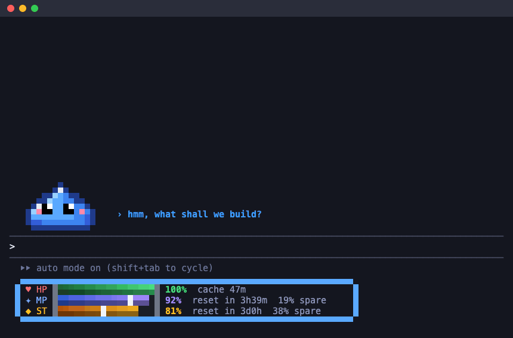

<div align="center">

# oxen-pet

### A pixel pet and an RPG-style usage HUD for Claude Code

A pixel **Luffy** lives above your Claude Code prompt and acts out every tool call, shifting through
**five gears** as Claude reads, runs, edits, fails and wins. Below the prompt, a
game HUD shows your **context window**, **5-hour and weekly rate limits**, and **prompt cache**,
so you always know how much is left. In bypass mode, its **shield** stops destructive commands
until you say so, and failing tests summon a **bug boss** to beat.

[](https://code.claude.com/docs/en/plugins/mods/interface)
[](CHANGELOG.md)
[](LICENSE)
[](SECURITY-AUDIT.md)
[](SECURITY-AUDIT.md)



[Install](#install) · [The pet](#what-the-pet-does) · [The HUD](#the-hud) · [The shield](#the-shield) · [/pet](#pet-session-stats) · [Make it yours](#make-it-yours) · [Settings](#settings) · [Security](#privacy-and-security) · [FAQ](#faq)

</div>

---

## Why oxen-pet

- 🎮 **See what Claude is doing at a glance.** The pet reads a book on `Read`, sweeps a magnifier on
  `Grep`, types on `Bash`, spins a globe on `WebFetch`, and cheers when a turn ends.
- 📊 **Never run out of usage by surprise.** HP, MP and ST bars track the context window and the
  5-hour and 7-day rate limits of a Pro or Max plan, with the time to each reset.
- 🧭 **Know whether you can keep going.** A pace mark on each limit bar shows where you would be at an
  even burn, and MP warns `empty ~1h20m` before the 5-hour limit runs out.
- 🔥 **Keep the prompt cache warm.** A countdown beside HP shows how long the cache lasts after the
  last turn, so you know when the next message gets more expensive.
- 🛡️ **Run bypass mode without fear.** Before `rm -rf`, `git push --force`, `git reset --hard`,
  `DROP TABLE` and other destructive commands run unasked, the pet raises a shield and asks you,
  with how many files each target holds.
- 🐛 **Make failing tests a game.** A failed test run brings a bug boss into the band; the next green
  run defeats it.
- 📈 **See your session at a glance.** `/pet` opens a pane with tool calls, files touched, test runs,
  and your burn rate.
- 🎨 **Make your own pet.** Ask Claude for a cat, a duck or an alien with its own props, scene, status
  lines and HUD colors. Claude shows you a preview page before anything changes.
- 🔒 **Safe to run.** No network, no processes, no environment variables, no tokens spent. It is a
  hardened, audited fork of [pixel-pet](https://github.com/Namenomeaning/pixel-pet).

## oxen-meter: the prompt cache, for a team

The same marketplace has a second plugin with no pet: **oxen-meter** measures the prompt cache hit rate of every
session, subagent and model, warns before a cold resume writes a whole context to the cache again, and exports
anonymized numbers for a team report. A command-line companion does the same for **Codex CLI** and **Devin CLI**
sessions, from their own logs and hooks, so one report covers all three. Install it with
`claude plugin install oxen-meter@oxen-pet`; its [README](plugins/oxen-meter/README.md) says what it records, how to
set up Codex and Devin, and how to read the report.

## Install

You need Claude Code v2.1.287 or later (`claude --version`).

```bash
claude plugin marketplace add thanhnhoncntt/oxen-pet
claude plugin install oxen-pet@oxen-pet
```

Start a new session, or run `/reload-plugins` in an open one. Luffy appears above the prompt.

To uninstall, run `claude plugin uninstall oxen-pet@oxen-pet`.

## Luffy's five gears

| Gear | When | Luffy |
| --- | --- | --- |
| **Gear 1** | Idle, sleeping, thinking, reading, searching | Straw hat, red vest, yellow sash; gnaws on meat while he reads. *"Gonna be King of the Pirates!"* |
| **Gear 2** | Bash, running, jumping | Pink steam; a flaming **Red Hawk** punch on every command. *"Gear Second! $ npm test"* |
| **Gear 3** | Editing | A giant Haki fist: **Elephant Gun**. *"Gomu Gomu no Elephant Gun!"* |
| **Gear 4** | A failed call, the shield up | **Boundman**, and a **Kong Gun** when a call fails. *"Not on my ship!"* |
| **Gear 5** | A turn ends, a boss falls | **Nika**: white cloud hair, clouds curling behind his back, the drums of liberation. *"Shishishi! Freedom!"* |

He calls the web on a Den Den Mushi (*"puru puru puru…"*), throws a **Gatling** and sends straw-hat
minis out as subagents (*"Zoro, don't get lost!"*), and runs over the sea under the Jolly Roger.

## What the pet does

| When | The pet |
| --- | --- |
| Claude is idle | Breathes, blinks, and looks around. Falls asleep after the **Sleep after** time, a minute by default. |
| A turn starts | Jumps |
| A tool call ends | Runs back and forth for 4 seconds |
| Claude thinks longer | Looks around, with `?` and dots |
| `Read` | Reads a book |
| `Grep`, `Glob` | Sweeps a magnifier |
| `Edit`, `MultiEdit`, `Write`, `NotebookEdit`, `TodoWrite` | Writes with a pen |
| `Bash`, and any tool not listed | Types in a small terminal |
| `WebFetch`, `WebSearch` | Spins a globe |
| A subagent starts | Smiles. A mini joins the trail behind the pet until that subagent finishes. |
| A tool call fails | `x x` eyes and a sweat drop |
| A turn ends | Cheers |
| A destructive command waits for you | Holds up a shield ([The shield](#the-shield)) |
| A test run fails | A bug boss walks in at the right, with a pip per failed run. The next passing run defeats it, and the pet cheers. |
| The context runs low | Says so in red, and a toast suggests `/compact` or a hand-off |

The pet's face follows the HUD too: it looks worried as the context fills up, and tired when a rate
limit runs low. With **Name files and commands** on, the status line also names the target, such as
`reading app.ts` or `$ npm test`. It is off by default.

## The HUD


One line below the prompt holds up to three bars. Each shows what is **left**, not what is used.

| Bar | Tracks | Beside the reading |
| --- | --- | --- |
| **♥ HP** | The context window left | `cache 52m`: how long the prompt cache stays warm after the last turn, then `cache cold`. `⚠ HP` and `/compact` under 20 %. |
| **✦ MP** | The 5-hour rate limit left | The time to its reset, and how far ahead of an even pace you are (`15% spare`) or behind (`5% over`). `empty ~1h20m` in red when the burn so far would empty it before the reset. |
| **◆ ST** | The 7-day (weekly) rate limit left | The time to its reset, and `spare` or `over` as for MP. |

**Reading the pace mark.** The light column on the MP and ST bars is where the bar would be if the
limit were used evenly through its window. Fill to the right of the mark means you are using less
than the pace and can push harder. Fill to the left means you are burning faster than the window
allows.

The line shows each reading and one short detail: the cache for HP, the time to reset for MP and ST, or
a warning in their place. For every detail in the table above, `spare` and `over` included, set
**HUD layout** to `stacked`: a framed window with one bar per line. A terminal too narrow for the line
(about 90 columns) gets the stacked window. One narrower than the window (64 columns), such as a pane
split beside other agents, gets one bar per line with no window, the bars shorter and the text cut at
the edge; under 16 columns the HUD hides.

HP turns yellow at 50 % or less and red at 25 % or less. As it drops under 20 %, a toast suggests
`/compact`, or handing off to a fresh session, once until HP climbs back to 30 %. MP and ST turn red under 15 %, and show on
Pro and Max plans once a response has reported its limit.

## The shield

Bypass mode and auto mode are fast, until Claude runs the wrong `rm -rf`. The shield steps in only
when Claude Code would run a Bash command **without asking you**, and only for commands that destroy
work:

> oxen-pet shield: `rm -rf build dist` deletes files and folders for good. build: 132 files ·
> dist: 2000+ files. Run it?

- **Block it** (the first option) refuses the call, and Claude reads that you blocked it.
  **Run it** lets it through.
- Covered: recursive `rm`, `git push --force`, `git reset --hard`, `git clean -f`,
  `git checkout -- .`, `git restore`, `git branch -D`, `git stash drop`/`clear`,
  `DROP`/`TRUNCATE TABLE`, `terraform destroy`, `kubectl delete`, `docker system prune`,
  `find -delete`, `dd` and `mkfs`.
- When Claude Code asks you anyway (default mode), the shield adds what the command deletes to its
  dialog and asks nothing itself.
- With no one to answer (`claude -p`, CI), the command is blocked. Turn **Shield** off for unattended
  runs.

## /pet: session stats

Type `/pet` to open a pane with what this session did; `/pet` again closes it.

```text
Session    1h12m · 14 turns
Tools      96 calls: 31 read · 12 search · 18 edit · 33 bash · 2 agent · 3 failed
Files      22 read · 9 edited
Tests      6 runs: 4 passed · 2 failed · 1 boss beaten
Shield     2 asked: 1 blocked · 1 ran
Burn       MP 9%/h · context 41% used
```

File names stay out unless **Name files and commands** is on.

## Make it yours

Ask Claude in any session, or run `/oxen-pet:oxen-pet`:

> *"Make my pet an orange cat with a fish instead of the book, and put it on the moon."*

Claude can change the pet, its props, minis, status lines, HUD colors and labels, its look in each
mode (`forms`, like Luffy's gears), or add a scene with ground, sky and obstacles the pet leaps over. It
writes a preview page (`/tmp/oxen-pet-preview-*.html`) with every motion and face first, and sets the
theme only when you approve. To undo, ask for the default pet back.

**Your pets survive updates.** Claude saves each pet you make as `<name>.theme.json` in
`~/.claude/oxen-pet/themes/`, outside the plugin's install folder, which an update replaces. Drop
theme files there yourself, or point **Custom folder** at a folder you sync.

```text
/pet theme          list the built-in pets and yours
/pet theme zoro     switch now, no tokens, and keep it for later sessions
```

Set **Theme** to make one the pet every session starts with. Built in: `luffy` (default), `slime`,
[`duck`](plugins/oxen-pet/assets/duck.json), and [`alien`](plugins/oxen-pet/assets/alien.json) (which
uses every field). The theme format is in
[`FORMAT.md`](plugins/oxen-pet/skills/oxen-pet/FORMAT.md).

## Settings

In a session, run `/plugin configure oxen-pet@oxen-pet`.

| Setting | Default | What it does |
| --- | --- | --- |
| Speed | `normal` | How quickly the pet runs and animates: `slow`, `normal`, or `fast`. |
| Sleep after (seconds) | `60` | Idle time before the pet falls asleep. `0` keeps it awake. |
| HUD | on | The HP, MP, and ST bars below the prompt. |
| Status line | on | The text beside the pet. |
| Name files and commands | **off** | The status line names the file, pattern, command, host, or search query a tool works on. |
| Subagent minis | on | A mini behind the pet for each running subagent. |
| Cache timer | `1h` | How long the HUD counts the prompt cache warm after a turn: `1h`, `5m`, or `off`. |
| Theme | `luffy` | The pet a session starts with: `luffy`, `slime`, `duck`, `alien`, or the name of one of your own. |
| Custom folder | empty | The folder of your own `<name>.theme.json` files. Empty: `~/.claude/oxen-pet/themes`. |
| HUD layout | `row` | `row`: the three bars in one line with no frame, each with its reading and one short detail; stacked on a terminal under about 90 columns. `stacked`: a framed window, one bar per line, with every detail. |
| Shield | on | Ask before a destructive Bash command runs unasked. With no one to answer, it is blocked. |
| Bug boss | on | A failed test run brings a bug boss into the band. |

From a shell:

```bash
echo '{"speed": "fast", "targets": "true"}' | claude plugin configure oxen-pet@oxen-pet --values-stdin
```

Settings apply after Claude Code restarts.

## Privacy and security

oxen-pet runs inside your Claude Code session, so it is built to do as little as possible:

- **No network requests, no processes, no environment variables.** The shipped code is checked for
  each of these before every push; the commands are in [`SECURITY-AUDIT.md`](SECURITY-AUDIT.md).
- **No tokens spent.** The HUD reads the same usage figures as the status line. It never calls the model.
- **The shield reads, it never runs.** It matches the command's text and counts files under an `rm`
  target with the file system's own listing, never following a symbolic link. It refuses a call only
  on your **Block it**, or when no one can answer. If the shield itself fails, Claude Code's own
  decision stands.
- **Nothing on screen you did not choose.** File names and commands stay out of the status line
  unless you turn on **Name files and commands**, so a shared screen or a recording shows none.
- **One guarded file write.** The theme preview writes only `oxen-pet-preview*.html` files, and
  refuses `..` paths and symbolic links.
- **No self-updating marketplace.** Upstream changes come in only by a full read of the diff and a
  cherry-pick.

## FAQ

<details>
<summary><b>How do I see my Claude Code rate limits and usage in the terminal?</b></summary>

Install oxen-pet. The MP bar is the 5-hour limit and the ST bar the weekly (7-day) limit, each with the
percentage left and the time to its reset. They appear on Pro and Max plans after the first response
of a session.
</details>

<details>
<summary><b>What does "38% spare" mean?</b></summary>

You have 38 points more of the limit left than you would at an even pace. For example, three days
before a weekly reset an even pace leaves about 43 %; at 81 % left you are 38 points ahead.
</details>

<details>
<summary><b>What is "cache cold", and why does it matter?</b></summary>

Claude Code caches the conversation so each new message re-reads it cheaply. The cache lapses some
time after the last turn: an hour or five minutes, depending on your setup. Set **Cache timer** to
match. Once it reads `cache cold`, the next message rebuilds the cache and costs more of your limit.
</details>

<details>
<summary><b>Where does it show?</b></summary>

In any terminal with 24-bit color, and in the Desktop app's Code tab, where the pet, its scene, the
boss and the HUD draw as SVG. The `/pet` pane shows on every surface that shows panes. The VS Code
chat panel, `claude -p`, and cloud sessions do not show the band.
</details>

<details>
<summary><b>Is it safe to run Claude Code in bypass permissions mode?</b></summary>

Safer with the shield: a destructive Bash command waits for your answer instead of running. It is a
pattern match, not a sandbox, so it can miss a command spelled in a way it does not know (a script
that deletes files, say). Keep your work committed, and use Claude Code's own permission rules for
anything that must never run.
</details>

<details>
<summary><b>How is it different from pixel-pet?</b></summary>

oxen-pet is a fork of [pixel-pet](https://github.com/Namenomeaning/pixel-pet) with a security audit
and fixes (a guarded preview write, file names hidden by default), plus the pace marks, the MP
forecast, the prompt cache timer, the shield, the bug boss, the `/pet` pane and the desktop HUD. What each version changed is in [`CHANGELOG.md`](CHANGELOG.md).
</details>

## Update

```bash
claude plugin marketplace update oxen-pet
claude plugin update oxen-pet@oxen-pet
```

Installed copies update only when `version` in `plugins/oxen-pet/.claude-plugin/plugin.json`
changes. What each version changed is in [`CHANGELOG.md`](CHANGELOG.md).

## Develop

<details>
<summary>Layout, commands, and the demo recorder</summary>

```text
.claude-plugin/marketplace.json   the repo is a marketplace with two plugins: oxen-pet and oxen-meter
plugins/oxen-pet/                 the plugin: a Claude Code mod
  .claude-plugin/plugin.json      name, version, and settings
  hooks/hooks.json                points Claude Code at register.tsx
  hooks/register.tsx              wires Claude Code's events to the modules, and serves the tools
  hooks/anim.ts                   what the pet does on each tick
  hooks/pixels.ts                 draws a frame
  hooks/theme.ts                  reads a theme and makes its frames
  hooks/scene.ts                  lays out and draws a theme's scene
  hooks/preview.ts                writes the preview page
  hooks/previewPath.ts            where preview_theme may write
  hooks/status.ts                 the status line
  hooks/hud.ts                    the HP, MP, and ST bars, the pace marks, the cache timer, the low-context alert
  hooks/guard.ts                  the shield: which commands destroy work, and the question it asks
  hooks/boss.ts                   the bug boss: test runs, hits, and its drawing
  hooks/stats.ts                  what the /pet pane counts
  hooks/minis.ts                  a mini per subagent
  hooks/settings.ts               reads the settings
  hooks/*.test.ts                 the tests, one file per module
  types/index.d.ts                the mod's state
  assets/                         luffy (default), slime, duck, alien themes
  hooks/custom.ts                 the custom themes folder and theme names
  skills/oxen-pet/                the skill that draws a pet with you, and the pet format
plugins/oxen-meter/               the prompt cache meter: a mod with no band
  hooks/register.tsx              wires Claude Code's events to the modules
  hooks/record.ts                 step and event records, and the collector
  hooks/provider.ts               a model's provider and family, and what its tokens weigh
  hooks/analyze.ts                hit rate, token equivalent, TTLs, gap curves, cold resumes, handoffs, quota, anti-patterns
  hooks/sessionFile.ts            a session's file: written whole, kept under 3 MiB, emptied when expired
  hooks/dataPath.ts               where the meter (and its CLI) may write
  hooks/resume.ts                 the cold resume guard: who a message resumes, the risk, what the user is asked
  hooks/hookGuard.ts              the CLI's guard for Codex and Devin: the risk, the warning, the held-back prompt
  hooks/codexLog.ts               Codex's rollout files, a line at a time, as records
  hooks/devinLog.ts               Devin's session nodes as records
  hooks/exportFile.ts             /meter export: the sessions of the last days, anonymized
  hooks/project.ts                the project's name, hashed
  hooks/report.ts                 the /meter pane's rows and /meter report
  hooks/codex.ts                  which Bash calls are Codex handoffs or outcomes
  hooks/timing.ts                 how long the meter's own hooks take
  hooks/settings.ts               reads the settings
  README.md                       for the team: install, use, Codex and Devin, reading the report, what it records
tools/meter/oxen-meter.mjs        the CLI for Codex and Devin: import, report, export, setup, hook (ships in the clone)
tools/meter/lib/                  its parts: files and guards, imports, hooks, setup
tools/meter/aggregate.mjs         builds the team report from exports (developer tool)
tools/preview/build.mjs           writes the preview of a theme file
tools/demo/record.mjs             records docs/images/demo.gif and hud.png (developer tool, never shipped)
docs/                             design spec and plan of the fork, and the README images
```

Load your working copy for one session with `claude --plugin-dir ./plugins/oxen-pet`. Before a
push, run:

```bash
claude plugin validate . --strict
claude plugin validate plugins/oxen-pet --strict
claude plugin test plugins/oxen-pet
claude plugin validate plugins/oxen-meter --strict
claude plugin test plugins/oxen-meter
node --test 'tools/meter/*.test.mjs'
```

After one `--plugin-dir` session, `npx -p typescript tsc -p plugins/oxen-pet` type-checks the mod.
`node tools/preview/build.mjs [theme file]` (Node 22.18+) writes `tools/preview/preview.html`.
`node tools/demo/record.mjs` (Node 22.18+, Google Chrome and ffmpeg) records the README's GIF from the
mod's own modules: no screen capture and no tokens. Contributor rules are in [`CLAUDE.md`](CLAUDE.md).
</details>

## License

Luffy, the Straw Hat Jolly Roger and One Piece are © Eiichiro Oda / Shueisha / Toei Animation. The
pixel Luffy here is fan art, drawn for this project; oxen-pet is not affiliated with or endorsed by
them. The code is MIT.

[MIT](LICENSE). Original work © 2026 halluqinate ([pixel-pet](https://github.com/Namenomeaning/pixel-pet));
fork changes © 2026 NhonNguyen.

<sub>Keywords: Claude Code plugin, Claude Code mod, Claude Code statusline, Claude Code HUD, bypass permissions guard, rm -rf protection, usage tracker, One Piece Luffy pixel art, Gear 5,
rate limit monitor, context window, prompt cache, terminal pet, pixel art, Anthropic Claude.</sub>
