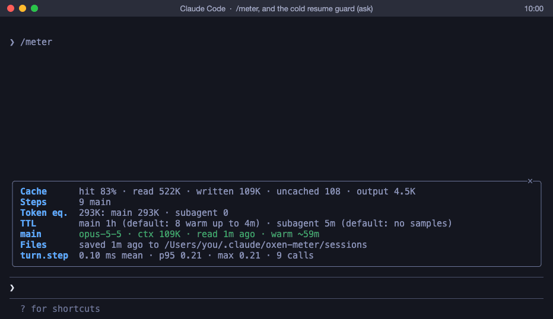
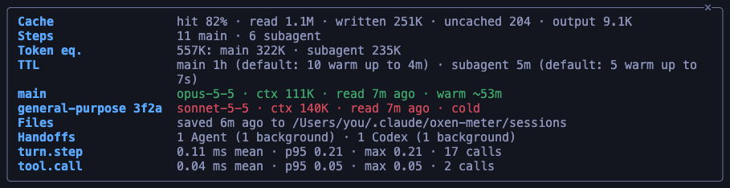
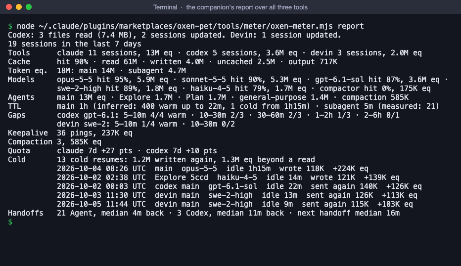

<div align="center">

# oxen-meter

### The prompt cache, measured for a team on Claude Code, Codex CLI and Devin CLI

See the cache hit rate of every session, subagent and model while it runs. Get a warning, or a question, before a
**cold resume** sends a whole context to the model again. Know the quota each session used. Then pool anonymized
numbers across a team to see where its cost and quota go.

[](https://code.claude.com/docs/en/plugins/mods/interface)
[](../../CHANGELOG.md)
[](#codex-cli-and-devin-cli)
[](../../SECURITY-AUDIT.md)
[](../../LICENSE)



<sub>A scripted session played through the meter's own modules: every line the meter shows is its own output.</sub>

[Install](#install) · [Quick start](#quick-start) · [The pane](#the-pane) · [The guard](#the-cold-resume-guard) · [Codex and Devin](#codex-cli-and-devin-cli) · [The report](#the-report) · [Team report](#the-team-report) · [Settings](#settings) · [Privacy](#what-it-records-and-what-it-does-not) · [FAQ](#faq)

</div>

---

## Why oxen-meter

The prompt cache prices input three ways against a plain input token: a **read** costs 0.1, a **write** 1.25 when the
cache lives 5 minutes, 2 when it lives an hour. Each read starts the cache's time to live over. A thread that sits
past it pays for its whole context again on its next request.

That is how a long task can eat a weekly limit. A subagent holding 400K tokens of context waits more than an hour
for a Codex audit, is resumed, and writes the 400K again. One such run took 30–35% of a weekly limit where 10–15% was
expected. oxen-meter shows those moments while they happen, warns before the ones it can see coming, and keeps the
numbers to compare across a team.

- 🔥 **See which cache is about to go cold.** `/meter` lists every live thread with its context and how long its
  cache has left: **warm**, **cooling** (the last fifth of its time to live), or **cold**.
- ✋ **Stop a cold resume before it costs you.** Before Claude resumes an agent whose cache likely expired, the meter
  warns you, or asks whether to spawn a fresh agent with a short handoff instead.
- 🧮 **Compare cost without a price list.** The **token equivalent** weighs reads, writes and output in plain input
  tokens, so sessions, people and models compare directly.
- ⏱️ **Learn your real TTLs.** The meter measures how long each cache lived, from what Claude Code reports and from
  the gaps around warm and cold requests, instead of trusting folklore.
- 🤝 **Codex CLI and Devin CLI too.** A command-line companion reads their logs and runs as their hooks, so one report
  covers all three tools, with the quota each session used.
- 📊 **Pool a team's numbers.** `/meter export` writes an anonymized file; one script turns everyone's files into a
  team report.
- 🔒 **Metadata only.** Token counts, times and names. Never a prompt, an answer, a path or a command. No network,
  no processes, and nothing added to what Claude sends: the meter stays out of the cache's way.

It measures the right side of the usual cost model, request by request:
cost = users × sessions × turns × requests per turn × tokens per request × price per token.

## Install

You need Claude Code v2.1.291 or later (`claude --version`).

```bash
claude plugin marketplace add thanhnhoncntt/oxen-pet
claude plugin install oxen-meter@oxen-pet
```

Start a new session, or run `/reload-plugins` in an open one. The meter records from the next model request on. It
draws no pet and no band, so it runs beside [oxen-pet](../../README.md) or alone.

## Quick start

| You use | Do this once | Then |
| --- | --- | --- |
| **Claude Code** | Install, above. | `/meter` opens the pane; `/meter report` adds up the last 7 days. |
| **Codex CLI** | `node $M setup codex --write`, then open Codex and trust the hooks in `/hooks`. | A warning before a prompt into a thread that sat an hour; `node $M report`. |
| **Devin CLI** | `node $M setup devin --write`, and set **Cold resume guard** to `ask` ([Settings](#settings)). | The prompt held back once before it resumes a cold session; `node $M report`. |
| **A team** | Each person runs `/meter export` (or `node $M export`) and sends the file. | `node tools/meter/aggregate.mjs --out report/ exports/` |

`$M` is the companion, `~/.claude/plugins/marketplaces/oxen-pet/tools/meter/oxen-meter.mjs`: see
[Codex CLI and Devin CLI](#codex-cli-and-devin-cli).

## The pane

`/meter` opens a pane with this session's numbers; `/meter` again closes it. It redraws every 15 seconds.



```text
Cache                 hit 82% · read 1.1M · written 251K · uncached 204 · output 9.1K
Steps                 11 main · 6 subagent
Token eq.             557K: main 322K · subagent 235K
TTL                   main 1h (default: 10 warm up to 4m) · subagent 5m (default: 5 warm up to 7s)
main                  opus-5-5 · ctx 111K · read 7m ago · warm ~53m
general-purpose 3f2a  sonnet-5-5 · ctx 140K · read 7m ago · cold
Files                 saved 6m ago to /Users/you/.claude/oxen-meter/sessions
Handoffs              1 Agent (1 background) · 1 Codex (1 background)
turn.step             0.11 ms mean · p95 0.21 · max 0.21 · 17 calls
tool.call             0.04 ms mean · p95 0.05 · max 0.05 · 2 calls
```

| Row | What it says |
| --- | --- |
| **Cache** | Cache read over the whole context the requests carried, then the four token counts. |
| **Steps** | Model requests, by the main thread and by subagents. |
| **Token eq.** | What the session cost in plain input tokens ([below](#reading-the-numbers)). |
| **TTL** | Each role's cache time to live, and how the meter knows it. |
| **Cold** | The cold resumes so far, and what they cost beyond a read. Absent while there are none. |
| **main**, one row per live subagent | Its model and context, when its cache was last read, and how long it has left: green warm, amber cooling, red cold. Resume a cooling agent soon, or let it go and spawn a fresh one later. |
| **Files** | Where the session is saved, or why it is not. |
| **Handoffs**, **Outcomes**, **Compactions** | Work given to subagents and Codex; commits and pull requests; compactions and their sizes. |
| **turn.step**, **tool.call** | How long the meter's own hooks take. |

Where no pane shows, `/meter` prints the same rows as text.

## The cold resume guard

Before Claude sends a message (SendMessage) that resumes an agent idle past nine tenths of its TTL, with at least
**Cold resume tokens** of context, the **Cold resume guard** setting decides:

- **warn** (default): a toast says what resuming costs; the message goes.
- **ask**: Claude Code asks you, as in the GIF:

  ```text
   ☐ Cold resume
  │ oxen-meter: general-purpose 3f2a has sat 7m, past its 5m cache. Resuming it writes its 140K
  │ context again: about 161K token equivalents. Spawn a fresh agent with a short handoff instead?
  ❯ 1. Spawn a fresh agent
    2. Resume anyway
  ```

  **Spawn a fresh agent** keeps the message back, and Claude reads that it should start a fresh agent with a short
  handoff instead. **Resume anyway** sends it. With no one to answer (`claude -p`, CI), the message goes.
- **off**: it is only recorded.

A thread that wakes on its own past its TTL, such as a subagent whose background Codex run just finished, cannot be
stopped by a plugin. It gets a toast, once per idle spell, and the report counts it.

## Codex CLI and Devin CLI

Neither can load a Claude Code mod, so the meter has a command-line companion, `tools/meter/oxen-meter.mjs` (Node
22.18 or later). It reads their logs into the meter's data folder and runs as their hooks.

Claude Code keeps a clone of this marketplace in `~/.claude/plugins/marketplaces/oxen-pet`, and
`claude plugin marketplace update oxen-pet` brings it up to date (the companion is in it from oxen-meter 1.1.0 on).
Run the companion from there, a path that stays put across updates, or from a clone of your own:

```bash
M=~/.claude/plugins/marketplaces/oxen-pet/tools/meter/oxen-meter.mjs
node $M import [days]          # Codex's ~/.codex/sessions and Devin's sessions.db, into the data folder
node $M report [days]          # the report over Claude Code, Codex and Devin, 7 days by default
node $M export [days]          # the export, for whoever has no Claude Code, 30 days by default
node $M setup codex --write    # adds the meter's hooks to ~/.codex/hooks.json (asks first, keeps a backup)
node $M setup devin --write    # the same in the "hooks" of ~/.config/devin/config.json
```

Once imported, `/meter report` and `/meter export` in Claude Code count Codex and Devin too. The companion takes your
oxen-meter settings from Claude Code (`~/.claude/settings.json`) and writes to the same data folder. An import reads
each Codex file on from where the last one stopped, so it stays quick: 2.1 GB of rollouts took 2.7 seconds the first
time.

| | Claude Code | Codex CLI | Devin CLI |
| --- | --- | --- | --- |
| Where the numbers come from | every request, live | every request, from its rollout files | every request, from its database |
| Cache writes | 5m or 1h | none: OpenAI does not charge for them | Claude models only |
| How long the cache lives | a TTL, 5m or 1h, measured or inferred | no fixed TTL: the gap curve | no fixed TTL: the gap curve; Devin pings its cache to keep it |
| Subagents | each a thread | each its own rollout, a thread by its role | each chain a thread by its profile |
| Quota | the 5-hour and 7-day windows | the weekly window | not kept locally |
| Before a cold resume | toast, or a question | hooks: a message, or the prompt held back once | hooks: the prompt held back once |

### The hooks

`setup` prints what it would add; `--write` adds it after a yes, beside your own hooks, and keeps the old file as
`….oxen-meter.bak`. It never touches `~/.claude/settings.json`. Codex runs a new hook only once you trust it: open
Codex and run `/hooks`. The hooks run the Node that ran `setup`; after you upgrade Node, run `setup` again.

- **Codex.** A prompt into a thread that sat past **Cold after** (60 minutes by default) with at least **Cold resume
  tokens** of context shows a line that the model never sees:

  ```text
  ↳ Hook · oxen-meter: this thread sat 1h12m. Its 180K context is likely out of the cache, so this
    prompt sends it all again (~162K eq). A fresh thread with a short summary costs less.
  ```

  With the guard on `ask`, the prompt is held back once instead: press ↑ and Enter to send it anyway. A follow-up
  (`followup_task`, `send_message`) to a subagent that sat as long gets the same line; Codex cannot ask before a tool
  call, so it is never held back. Each turn's, subagent's and session's end imports that thread at once.
- **Devin.** Devin shows no message from a hook, only a held-back prompt's reason, so `warn` says nothing there. With
  the guard on `ask`, a prompt into a session that sat past Cold after is held back once, and ↑ and Enter send it:

  ```text
   ✱ Prompt blocked: oxen-meter: this thread sat 1h05m. Its 120K context is likely out of the cache,
     so this prompt sends it all again (~108K eq). Press ↑ and Enter to send it anyway, or start a
     fresh thread with a short summary.
  ```

  Devin's keepalive pings read the cache every few minutes, so the guard counts from the last one. Each turn's and
  session's end imports that session.

A hook prints nothing and lets everything through when anything goes wrong. A Codex hook takes about 70 to 180 ms a
run, a Devin one 150 to 460 ms (it opens Devin's database), Node's start included.

## The report

`/meter report [days]` in Claude Code, or `node $M report [days]`, adds up your sessions of the last days, 7 by
default, over every tool:



### Reading the numbers

- **Hit rate**: cache read over the whole context the requests carried. A low one means the same context is written
  again and again.
- **Token equivalent**: the cost in plain input tokens: uncached + writes × 1.25 (5m) or × 2 (1h) + reads × 0.1 +
  output × the output weight. For a model with no cache writes (OpenAI, SWE), a cached token weighs the **Cached input
  weight**. It compares sessions, people and models without a price list.
- **TTL**: how long each role's cache lives, and how the meter knows. `measured`: Claude Code reported it (an Agent
  call's cache writes, split 5m/1h, or a model switch). `inferred`: from the gaps around warm and cold steps; a cold
  step after 5.5–60 minutes says 5m, a warm one after more than 5.5 minutes says 1h. `default`: no evidence yet.
  `setting`: you chose it.
- **Cold resume**: a step whose gap passed its TTL and that wrote at least the cold resume tokens again, or a session
  resumed (`claude --resume`) after its cache likely expired. For Codex and Devin, which have no TTL, a step that sent
  its context again after 5 minutes or more. "Beyond a read" is what it cost over reading the same context warm.
  Steps after a compaction, a model switch or a rewind are left out: those write the context anyway.
- **Tools**: each tool's sessions and token equivalent, when the report holds Codex or Devin.
- **Gaps** (the gap curve, Codex and Devin): of the steps that came after the thread sat 5–10 minutes, 10–30, 30–60,
  1–2 hours, 2–6 and longer, how many read their context back from the cache (`warm`). It is how long their cache
  lived for you; set **Cold after** from it.
- **Keepalive**: Devin's pings that keep a cache warm, and what they cost. **Compaction**: how many, and what the
  compactions' own requests cost (Codex and Devin report them).
- **Quota**: the points of each rate-limit window that moved while your sessions ran (`claude 7d +12 pts`). Readings
  more than an hour apart are not joined, since someone else's use may sit between them; two accounts count apart.
- **Handoffs**: work given to a subagent (Agent), to Codex, or back to an agent by a message (resume). "Back" is how
  long it took to return; "next handoff" is how long the thread took to hand off again, such as sending the fix.
- **Flags** (anti-patterns):
  - *context bloat*: a thread at 150K context or more for 20 steps without a compaction. Compact or hand off sooner.
  - *big first prefix*: a thread's first request carried 40K or more: many MCP servers, tool schemas, a large prompt.
  - *short task on an expensive model*: a subagent on Opus for five steps or fewer. Give such agents a smaller model.

**Limits.** Claude Code reports a request's cache writes as one number, not split by TTL, so a role's TTL is measured
only where an Agent call or a model switch reports it, and inferred elsewhere; the report shows the samples behind
it. The token equivalent leaves out what the price list adds on top, such as long-context pricing.

## The team report

Each person runs `/meter export [days]` (30 days by default), or `node $M export` without Claude Code. It writes one
anonymized file to `exports/` in the data folder and prints its path. Whoever collects the files clones this repo
and runs, with Node 22.18 or later:

```bash
node tools/meter/aggregate.mjs --out report/ path/to/exports/
```

It writes `report/team-report.md` and `team-report.json`: the team's summary; one row per person (by their label),
tool, agent type and model; the top 20 cold resumes; each role's TTL with its samples; the Codex and Devin caches by
gap; the quota each person used; a row per week; the flags and handoffs per person; the meter's own hook timing.
`--cold-tokens`, `--output-weight` and `--cached-weight` set the team's thresholds.

## Settings

Run `/plugin configure oxen-meter@oxen-pet`. Every setting has a default, and the companion reads the same ones.

| Setting | Default | What it does |
| --- | --- | --- |
| Cold resume guard | `warn` | `off`, `warn` or `ask`, [above](#the-cold-resume-guard). |
| Cold resume tokens | `50000` | How large a context must be before writing it again counts as a cold resume. |
| Main thread cache TTL | `auto` | `auto` uses the TTL the meter measured or inferred, 1h until it has samples; or `5m`, `1h`. |
| Subagent cache TTL | `auto` | The same for subagents, 5m until it has samples. |
| Your label | empty | The name your exports carry in the team report. Empty: `anonymous`. |
| Hash project names | on | The project is kept as a hash salted with a key of your own, never its name. |
| Output weight | `5` | What one output token weighs against one uncached input token in the token equivalent. |
| Keep sessions (days) | `30` | Session files older than this are emptied (below). |
| Data folder | empty | Where sessions and exports go. Empty: `oxen-meter` in your `.claude` folder. |
| Cached input weight (Codex, Devin) | `0.1` | What a cached input token of a model with no cache writes (OpenAI, SWE) weighs against an uncached one. |
| Cold after (Codex, Devin) | `60` | Minutes a Codex or Devin thread may sit before the companion's hooks warn its cache is likely gone. |

Settings apply after Claude Code restarts. The companion reads them from Claude Code's settings file,
`~/.claude/settings.json`, under `pluginConfigs` → `oxen-meter@oxen-pet` → `options`, with the setting names of
`plugin.json` (`resumeGuard`, `coldAfterMin`, …). Without Claude Code, keep a file of that shape, such as
`{"pluginConfigs": {"oxen-meter@oxen-pet": {"options": {"resumeGuard": "ask"}}}}`, and pass it as
`--claude-settings <file>`; `setup` puts the flag in the hooks it adds.

## What it records, and what it does not

Recorded, for each model request: when it started and ended, the thread (main or the agent's id), the agent type,
model and effort, the four token counts, the context size, the gap since the thread's last request, the message
count, the names of the tools it asked for, and why it stopped. Around them: a subagent's start and stop; an Agent
call's agent, type, model, total tokens and cache split; a Codex call's sub-command (`task`, `review`, `exec`), times,
and whether it ran in the background or failed; a count of commits and pull requests; a compaction's sizes; who a
message to an agent went to, and what the guard did; a resumed session's idle time and context; reported TTLs; each
rate-limit reading that moved (its window's length, how much of it is used, when it resets). For the session: its id,
the tool it ran in, the project as a salted hash, its start, its cost as `/cost` totals it, the meter's version and
settings, and how long the meter's own hooks took. A Devin step sent only to keep the cache warm is marked as such.

For Codex and Devin the command-line companion keeps the same records, from their logs: each request's four token
counts, model, effort, times and tool names; a subagent's start and stop, by its role or profile; a handoff to it and
a follow-up, with the thread's idle time and context; a compaction's tokens; a keepalive's mark; each rate-limit
reading. From a Codex line it parses only the kinds it records; from Devin's database it takes metadata only, with
SQLite's own JSON functions, so a message's text never reaches it. The project folder is hashed with the same salt.

Never recorded: prompts, answers, thinking, a tool's input or output, file names or paths, commands, message text,
environment variables. The meter makes no network request and starts no process, and it never adds to what Claude
sends: no system prompt section, no message, no rewritten request.

An export goes further: each session's id is hashed, agent and turn ids become `a1`, `t1`, MCP tool names become
`mcp`, times count from the session's start (only its day is kept), and no folder appears in it.

Files live in the data folder: `sessions/<session id>.json` (and `codex-<id>.json`, `devin-<id>.json`), written by a
timer after a main turn ends and when the session ends, or by an import; `exports/oxen-meter-export-<date>[-<label>].json`;
and in `state/`, the salt the mod and the companion share, where each import stopped, and its locks. Nothing else is
written in it, and every write is checked first (no `..`, no symbolic link). `setup --write` writes Codex's or
Devin's hook configuration alone, after a yes, with a backup. A plugin cannot delete a file, so a session file past
**Keep sessions (days)** is emptied to a few bytes instead. The checks are in [`SECURITY-AUDIT.md`](../../SECURITY-AUDIT.md).

## FAQ

<details>
<summary><b>Does the meter itself cost tokens, or change what Claude sends?</b></summary>

No. It reads the token counts Claude Code reports after each request and passes every request on untouched: it adds
no system prompt section, no message and no tool, and never rewrites a model or an effort. Its hooks only add to
what it holds in memory and return; the pane shows how long they take.
</details>

<details>
<summary><b>How long does the cache really live?</b></summary>

What the meter measured so far (Claude Code 2.1.291, Sonnet 5.5 and Opus 5.5, 2026-10-06): a subagent's cache writes
were all 5m (an Agent call's split, measured), and a subagent idle 5.4 to 12 minutes wrote its whole context again. The
main thread stayed warm after 10 minutes idle in an interactive session (1h), but wrote its context again after 6
minutes in `claude -p` (5m). Codex (one machine, 60 days): gpt-5.6 read its context back 30 of 33 times after 5–10
minutes, 14 of 23 after 1–2 hours, never after 2 hours; gpt-6.1 was still warm after 8 minutes. Devin's SWE-2: 2 of 7
after 5–10 minutes, none after 10. These may differ by plan, mode and version: let the meter keep measuring, and read
your own TTL row and gap curves.
</details>

<details>
<summary><b>Why does the guard ask about a subagent but only warn when one wakes on its own?</b></summary>

A message Claude sends to an agent passes through the meter, which can hold it back on your answer. A subagent that
wakes because its background command finished starts its request inside Claude Code; a plugin could only stop it by
answering in the model's place, which the meter never does. It shows a toast, and the report counts it.
</details>

<details>
<summary><b>The Codex hook never fires.</b></summary>

Codex runs a new hook only after you trust it: open Codex, run `/hooks`, and trust the oxen-meter entries. Check that
`node --version` is 22.18 or later for the Node `setup` recorded, and run `setup codex --write` again after you move
the companion or upgrade Node.
</details>

<details>
<summary><b>Devin says nothing in warn mode.</b></summary>

Devin shows the user no message from a hook, only the reason a prompt was held back. Set **Cold resume guard** to
`ask` to see the meter there: the prompt is held back once, and ↑ and Enter send it.
</details>

<details>
<summary><b>Can the team see my prompts or project names in an export?</b></summary>

No. Records hold counts, times and names from a fixed set; an export hashes session ids, renames agents and turns,
keeps times relative to each session's start, and carries no folder. Project names are salted hashes unless you turn
**Hash project names** off, and the salt stays on your machine. Open the file before you send it: it is plain JSON.
</details>

## Uninstall

Run `claude plugin uninstall oxen-meter@oxen-pet`. Take the oxen-meter entries out of `~/.codex/hooks.json` and
`~/.config/devin/config.json` (or put the `.oxen-meter.bak` files back), then delete the data folder if you want.
